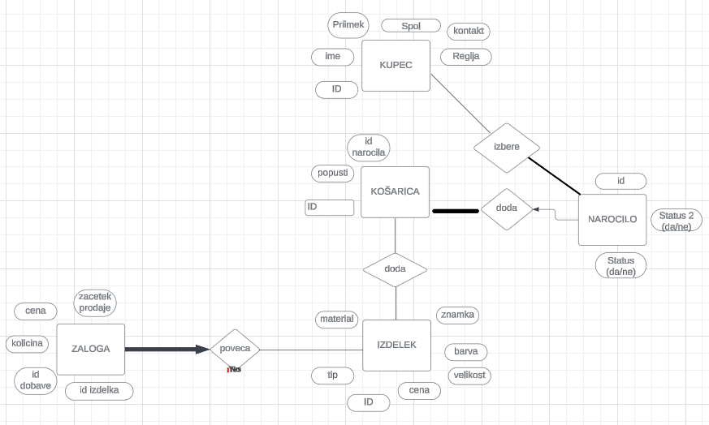

# Spletna Trgovina z Oblačili

## Opis projekta

Ta projekt predstavlja spletno aplikacijo za spletno trgovino z oblačili. Glavni namen aplikacije je omogočiti uporabnikom pregled in nakup različnih oblačil ter upravljanje zalog in naročil. Uporabniki lahko brskajo po katalogu izdelkov, dodajajo artikle v košarico ter potrdijo nakup.

## Funkcionalnosti

- **Brskanje po izdelkih:** Uporabniki lahko iščejo oblačila po tipu, velikosti in spolu.
- **Upravljanje košarice:** Uporabniki lahko dodajajo izdelke v košarico, urejajo količine in potrjujejo nakupe.

## Navodila za zagon

1. Prenesite celoten repozitorij na svoj računalnik.
2. Poženite datoteko `baza.py` za inicializacijo baze podatkov.
3. Poženite datoteko `spletni_vmesnik.py`, da zaženete spletni strežnik.
4. Odprite spletni brskalnik in obiščite prikazano lokalno povezavo, običajno `http://127.0.0.1:8080`.

## Tehnične zahteve

- Python 3.x
- SQLite3
- Knjižnica `Bottle` za spletni strežnik
- Knjižnica `Jinja2` za templating

## ER Diagram

Spodaj je prikazan ER diagram, ki ponazarja podatkovno shemo projekta.

### Opis ER Diagrama

- **KUPEC:** Vsak kupec ima edinstven ID, poleg tega pa vsebuje še informacije, kot so ime, priimek, spol, regija, in kontaktni podatki. Kupec lahko ustvari več naročil.
  
- **KOŠARICA:** Košarica beleži artikle, ki jih kupec želi kupiti. Povezana je s kupcem preko ID-ja in vsebuje izdelke s popusti.
  
- **IZDELEK:** Izdelek predstavlja oblačilo in vsebuje atribute, kot so tip, znamka, barva, velikost, material in cena. Izdelki se dodajajo v košarico in povezani so z dobavami.
  
- **ZALOGA:** Zaloga predstavlja dodano količino izdelka v zalogo. Vsaka dobava vsebuje edinstven ID, količino, ceno in datum začetka prodaje. En izdelek lahko pride v več dobavah.
  
- **NAROČILO:** Naročilo je povezano s košarico in kupcem. Status naročila beleži, ali je naročilo zaključeno ali ne. (Še nedokončano: Naročila so povezana z več distribucijskimi centri (distributerji)).

## Zaključek

Ta projekt omogoča simulacijo osnovnega poslovanja spletne trgovine z oblačili, od upravljanja zalog, do naročanja in sledenja naročilom. 